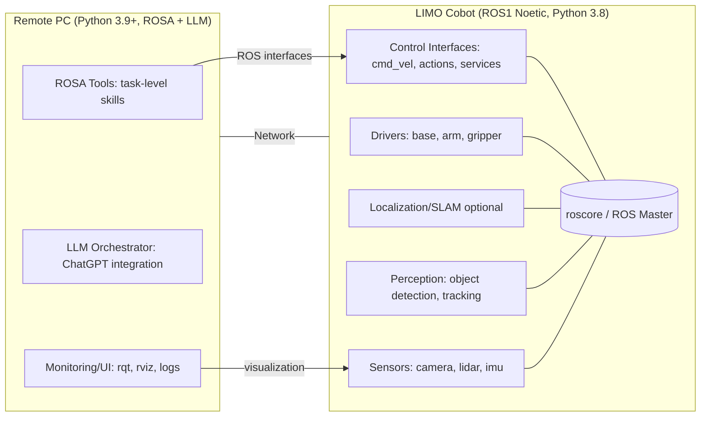

# Robot vs Remote PC Architecture (ROSA + ROS1 Noetic)

## Purpose
This document clarifies which components should run on the **LIMO Cobot (Robot)** versus the **Remote PC**, and discusses communication options between them.

Constraints:
- Robot: ROS 1 Noetic on Ubuntu 20.04, Python 3.8 (cannot upgrade)
- Remote PC: can run Python 3.9+ and hosts ROSA + LLM orchestration

Design goals:
- Keep robot-side control stable and vendor-compatible
- Keep LLM/ROSA logic off-robot
- Avoid streaming high-rate sensor data through fragile links when possible
- Expose “capabilities” as clean ROS interfaces (services/actions/topics)

---

## Recommended Diagram Types

### 1) Deployment Diagram (What runs where)
Use this to document placement: robot vs remote PC, processes, and network connections.

**Mermaid (Deployment View):**

## Component Placement (Guideline)
**Prefer on the Robot** (or on a nearby compute node on the same LAN using native ROS)

These components are bandwidth/latency sensitive and often require tight integration with drivers and TF:

- Hardware drivers and low-level controllers (base/arm/gripper)
- Sensor drivers (camera, lidar, imu)
- TF tree publishers and robot state publisher
- SLAM/localization if used during navigation
- Perception that consumes high-rate streams (object detection, tracking, depth processing)
- Anything safety-critical (emergency stop logic, collision stops, watchdogs)

**Prefer on the Remote PC**

These components are compute-flexible and benefit from rapid iteration:

- ROSA + LLM orchestration and planning
- High-level task logic (“fetch object”, “navigate to room”)
- Calling robot-side capabilities via services/actions
- UI/teleop/monitoring (rviz, dashboards), logging/metrics
- Tooling that queries state and triggers discrete capabilities (not continuous streaming)

Key principle: the remote PC should call capabilities (services/actions), not pull raw streams unless necessary.

## Communication Options (Robot ↔ Remote PC)
