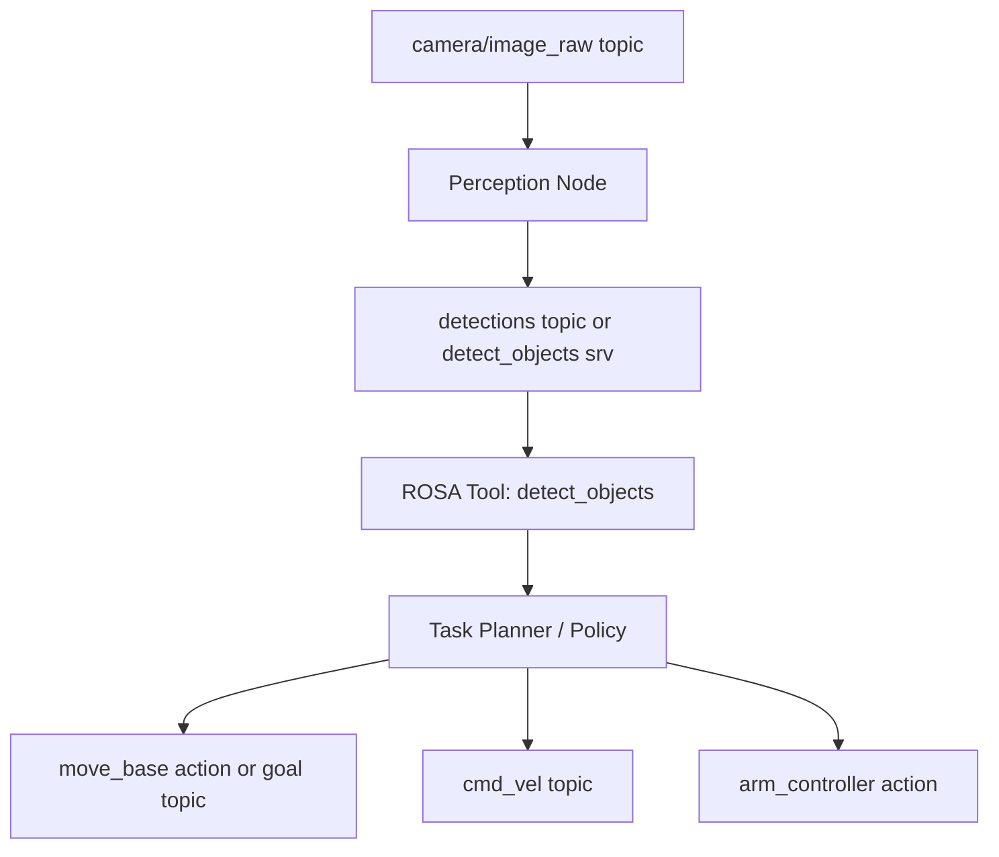

```mermaid
flowchart TB
  Camera[camera/image_raw topic] --> Perception[Perception Node]
  Perception --> Dets[detections topic or detect_objects srv]
  Dets --> ROSA[ROSA Tool: detect_objects]
  ROSA --> Plan[Task Planner / Policy]
  Plan --> Nav[move_base action or goal topic]
  Plan --> Base[cmd_vel topic]
  Plan --> Arm[arm_controller action]
```
