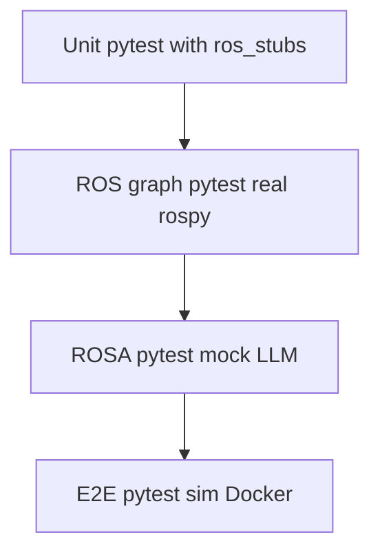

# Automated testing (pytest)

This document describes the **automated** pytest suite: layers, markers, environment variables, and how it relates to **manual** ROSA validation ([Testing ROSA Tooling](test_tooling.md)).

## Test pyramid



| Layer | Purpose | Typical environment |
|--------|---------|---------------------|
| **unit** | Fast checks with **fake** ROS modules (`tests/ros_stubs.py`); no `roscore`, no LLM API | Host, GitHub Actions |
| **ros_graph** | Real **rospy** / compute graph (topics, minimal smoke) | Machine or container with ROS Noetic and `roscore` |
| **rosa** | **jpl-rosa** agent loads `limo_llm_control.tools` with a **mocked** LLM (no API calls) | Host with `jpl-rosa` installed, or ROSA venv in Docker |
| **e2e** | Short **integration** checks (e.g. publish `/cmd_vel` smoke) when the full ROS stack is up | **Local or sim Docker only**; not run in default CI |

## Layout

| Path | Role |
|------|------|
| [`tests/unit/`](../../tests/unit/) | Unit tests; [`conftest.py`](../../tests/unit/conftest.py) installs ROS stubs and `PYTHONPATH=src` |
| [`tests/ros_graph/`](../../tests/ros_graph/) | Real ROS graph checks; **no** stubs |
| [`tests/rosa/`](../../tests/rosa/) | ROSA agent + tool discovery; stubs enabled so tool modules import without a real roscore |
| [`tests/e2e/`](../../tests/e2e/) | Env-gated smoke tests (`RUN_E2E=1`) |

## Markers

Defined in [`pytest.ini`](../../pytest.ini):

- `unit` — default fast suite (stubbed ROS).
- `ros_graph` — requires a running ROS master and real `rospy`.
- `rosa` — requires importable `rosa` (jpl-rosa).
- `e2e` — heavy / full stack; see environment variables below.

Run only unit tests (matches **default CI**):

```bash
pytest -m unit -v
```

Run everything except slow tiers:

```bash
pytest -m "not ros_graph and not e2e" -v
```

Run a specific tier:

```bash
pytest -m ros_graph -v
pytest -m rosa -v
pytest -m e2e -v
```

## Environment variables

| Variable | Effect |
|----------|--------|
| `RUN_ROS_GRAPH_TESTS=1` | Enables **ros_graph** tests (still skipped if `rospy` is missing or `ROS_MASTER_URI` is unset). |
| `RUN_E2E=1` | Enables **e2e** tests (intended for Docker sim or a machine with full ROS). |
| `ROS_MASTER_URI` | Required for ros_graph / e2E checks against a live `roscore` (e.g. `http://localhost:11311`). |

ROSA-tier tests use `pytest.importorskip("rosa")` if **jpl-rosa** is not installed (CI skips them without failing). To run them locally, install the package: `pip install jpl-rosa`.

## CI vs local

- **GitHub Actions** runs **`pytest -m unit`** only (fast, no ROS, no jpl-rosa required).
- **ROS graph**, **ROSA** (with `pip install jpl-rosa`), and **E2E** are intended for **local** development or a **sim Docker** image (see [`sim/docker/Dockerfile`](../../sim/docker/Dockerfile)).

## Running unit tests locally

From the repository root:

```bash
pip install -r requirements-dev.txt
pytest -m unit -v
```

## Running ROS graph / E2E in Docker (example)

Build and run the sim image (see [sim setup](../sim/setup.md) and [`sim/docker/Dockerfile`](../../sim/docker/Dockerfile)), then inside the container with `roscore` or your launch running:

```bash
export ROS_MASTER_URI=http://localhost:11311
export RUN_ROS_GRAPH_TESTS=1
export RUN_E2E=1
cd /workspace/llm-controlled-robots   # or your mount path
pip install -r requirements-dev.txt
pytest -m "ros_graph or e2e" -v
```

Adjust paths to match how the workspace is mounted (the Dockerfile sets `REPO_DIR=/workspace/llm-controlled-robots`).

## Manual end-to-end (ROSA chat)

For conversational validation (prompts, `rostopic list`, exploration flows), use [Testing ROSA Tooling](test_tooling.md). Automated tests do **not** replace that checklist; they complement it.

## See also

- [Testing ROSA Tooling](test_tooling.md) — manual ROSA and integration steps
- [Project structure](../project-structure.md) — where `limo_llm_control` and `catkin_ws` live
